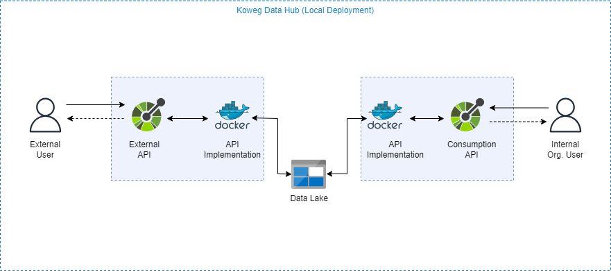

# Koweg Data Hub

This PoC demos a heterogeneous data hub will evolve to become a data lakehouse for various consumer applications and services.

## Features

1. Data ingestion API:
   - >http://127.0.0.1:7070/docs
   http://127.0.0.1:7070/redoc

2. Data consumption API:
   - >http://127.0.0.1:7071/docs
http://127.0.0.1:7071/redoc

## Dependencies

- [Azure Data Storage Explorer](https://azure.microsoft.com/en-us/products/storage/storage-explorer/)
- [Azure Blob Storage Emulator](https://github.com/Azure/Azurite)
- Docker

## Deployment

```
docker compose --env-file ./config/.env.local up 
```

```
 docker run -p 10000:10000 -p 10001:10001 -p 10002:10002 mcr.microsoft.com/azure-storage/azurite  -v ./datastore/azurite:/data/azurite
```

## Deployment Architecture


